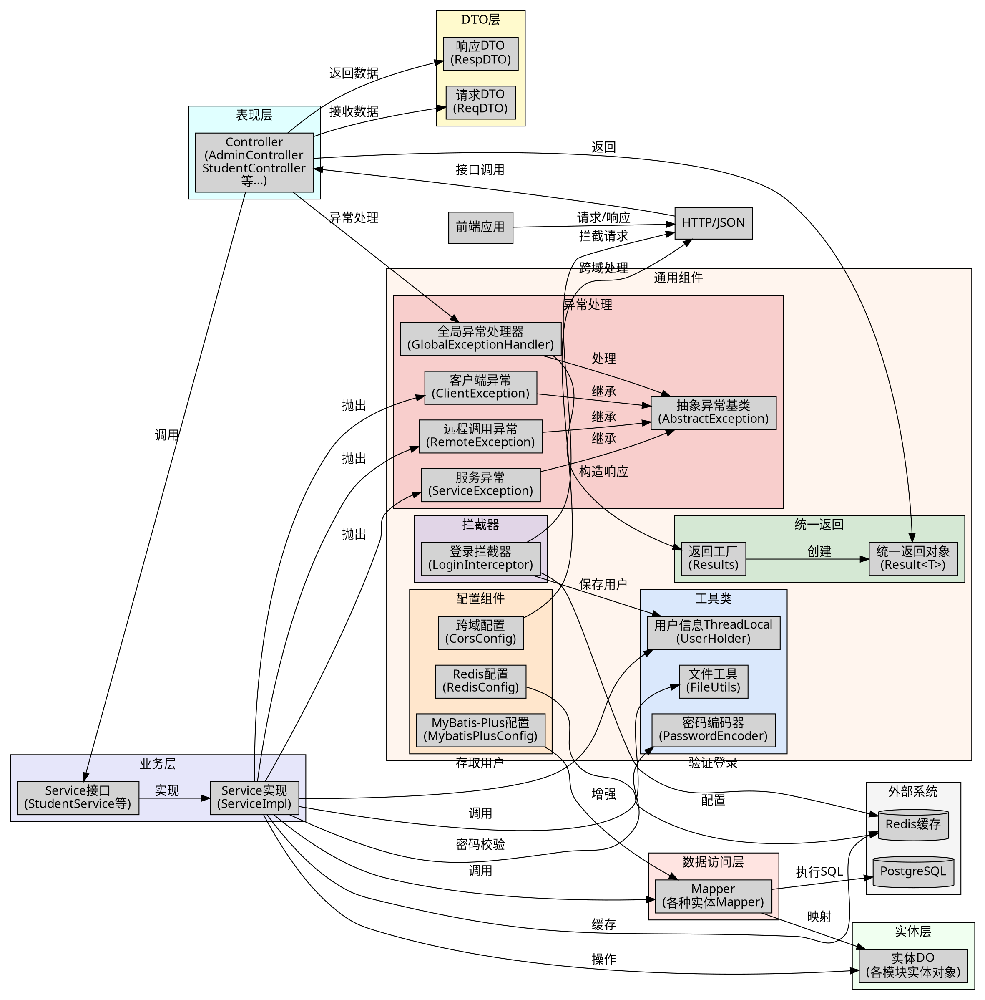

# GraphViz/DOT格式的代码层架构图

```dot
digraph CodeArchitecture {
    // 设置图表方向和样式
    rankdir=LR; // 从左到右布局
    node [shape=box, style=filled, fontname="微软雅黑"];
    edge [fontname="微软雅黑"];
    
    // 分组和子图 - 简化版
    subgraph cluster_presentation {
        label = "表现层";
        bgcolor = "#E0FFFF";
        Controller [label="Controller\n(AdminController\nStudentController\n等...)"];
    }
    
    subgraph cluster_dto {
        label = "DTO层";
        bgcolor = "#FFFACD";
        ReqDTO [label="请求DTO\n(ReqDTO)"];
        RespDTO [label="响应DTO\n(RespDTO)"];
    }
    
    subgraph cluster_service {
        label = "业务层";
        bgcolor = "#E6E6FA";
        Service [label="Service接口\n(StudentService等)"];
        ServiceImpl [label="Service实现\n(ServiceImpl)"];
    }
    
    subgraph cluster_data {
        label = "数据访问层";
        bgcolor = "#FFE4E1";
        Mapper [label="Mapper\n(各种实体Mapper)"];
    }
    
    subgraph cluster_entity {
        label = "实体层";
        bgcolor = "#F0FFF0";
        EntityDO [label="实体DO\n(各模块实体对象)"];
    }
    
    subgraph cluster_common {
        label = "通用组件";
        bgcolor = "#FFF5EE";
        
        subgraph cluster_config {
            label = "配置组件";
            bgcolor = "#FFE6CC";
            RedisConfig [label="Redis配置\n(RedisConfig)"];
            MybatisPlusConfig [label="MyBatis-Plus配置\n(MybatisPlusConfig)"];
            CorsConfig [label="跨域配置\n(CorsConfig)"];
        }
        
        subgraph cluster_utils {
            label = "工具类";
            bgcolor = "#DAE8FC";
            FileUtils [label="文件工具\n(FileUtils)"];
            UserHolder [label="用户信息ThreadLocal\n(UserHolder)"];
            PasswordEncoder [label="密码编码器\n(PasswordEncoder)"];
        }
        
        subgraph cluster_exception {
            label = "异常处理";
            bgcolor = "#F8CECC";
            GlobalExceptionHandler [label="全局异常处理器\n(GlobalExceptionHandler)"];
            AbstractException [label="抽象异常基类\n(AbstractException)"];
            ServiceException [label="服务异常\n(ServiceException)"];
            ClientException [label="客户端异常\n(ClientException)"];
            RemoteException [label="远程调用异常\n(RemoteException)"];
        }
        
        subgraph cluster_result {
            label = "统一返回";
            bgcolor = "#D5E8D4";
            Result [label="统一返回对象\n(Result<T>)"];
            Results [label="返回工厂\n(Results)"];
        }
        
        subgraph cluster_interceptor {
            label = "拦截器";
            bgcolor = "#E1D5E7";
            LoginInterceptor [label="登录拦截器\n(LoginInterceptor)"];
        }
    }
    
    subgraph cluster_external {
        label = "外部系统";
        bgcolor = "#F5F5F5";
        DB [label="PostgreSQL", shape=cylinder];
        Redis [label="Redis缓存", shape=cylinder];
    }
    
    // 前端节点
    Frontend [label="前端应用", shape=cloud];
    HTTP [label="HTTP/JSON"];
    
    // 连接关系 - 简化版
    Frontend -> HTTP [label="请求/响应"];
    HTTP -> Controller [label="接口调用"];
    
    Controller -> ReqDTO [label="接收数据"];
    Controller -> RespDTO [label="返回数据"];
    Controller -> Service [label="调用"];
    Controller -> GlobalExceptionHandler [label="异常处理"];
    
    Service -> ServiceImpl [label="实现"];
    
    ServiceImpl -> Mapper [label="调用"];
    ServiceImpl -> EntityDO [label="操作"];
    
    Mapper -> EntityDO [label="映射"];
    Mapper -> DB [label="执行SQL"];
    
    ServiceImpl -> Redis [label="缓存"];
    
    // 工具类和配置关系
    ServiceImpl -> FileUtils [label="调用"];
    ServiceImpl -> UserHolder [label="存取用户"];
    ServiceImpl -> PasswordEncoder [label="密码校验"];
    
    RedisConfig -> Redis [label="配置"];
    MybatisPlusConfig -> Mapper [label="增强"];
    CorsConfig -> HTTP [label="跨域处理"];
    
    // 异常处理
    ServiceImpl -> ClientException [label="抛出"];
    ServiceImpl -> ServiceException [label="抛出"];
    ServiceImpl -> RemoteException [label="抛出"];
    
    ClientException -> AbstractException [label="继承"];
    ServiceException -> AbstractException [label="继承"];
    RemoteException -> AbstractException [label="继承"];
    
    GlobalExceptionHandler -> AbstractException [label="处理"];
    GlobalExceptionHandler -> Results [label="构造响应"];
    
    Results -> Result [label="创建"];
    Controller -> Result [label="返回"];
    
    // 拦截器
    LoginInterceptor -> HTTP [label="拦截请求"];
    LoginInterceptor -> UserHolder [label="保存用户"];
    LoginInterceptor -> Redis [label="验证登录"];
}
```

# 使用说明
GraphViz/DOT格式的流程图需要使用GraphViz工具或在线服务渲染，如[GraphvizOnline](https://dreampuf.github.io/GraphvizOnline/)、[Viz.js](http://viz-js.com/)等。
