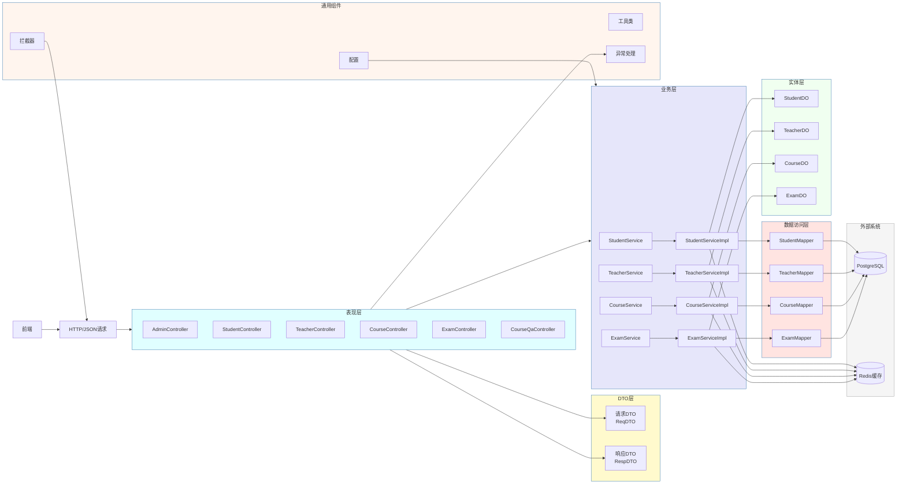

# Mermaid格式的代码层架构图

```mermaid
graph LR
    %% 定义节点样式
    classDef controller fill:#E0FFFF,stroke:#4682B4,stroke-width:1px;
    classDef dto fill:#FFFACD,stroke:#4682B4,stroke-width:1px;
    classDef service fill:#E6E6FA,stroke:#4682B4,stroke-width:1px;
    classDef mapper fill:#FFE4E1,stroke:#4682B4,stroke-width:1px;
    classDef entity fill:#F0FFF0,stroke:#4682B4,stroke-width:1px;
    classDef common fill:#FFF5EE,stroke:#4682B4,stroke-width:1px;
    classDef external fill:#F5F5F5,stroke:#A9A9A9,stroke-width:1px;

    %% 前端层
    FE[前端] --> HTTP[HTTP/JSON请求]
    
    %% 控制层
    subgraph Controller["表现层"]
        C1[AdminController]
        C2[StudentController]
        C3[TeacherController]
        C4[CourseController]
        C5[ExamController]
        C6[CourseQaController]
    end
    
    %% DTO层
    subgraph DTO["DTO层"]
        D1[请求DTO\nReqDTO]
        D2[响应DTO\nRespDTO]
    end
    
    %% 业务层
    subgraph Service["业务层"]
        S1[StudentService]
        S2[TeacherService]
        S3[CourseService]
        S4[ExamService]
        
        S1Impl[StudentServiceImpl]
        S2Impl[TeacherServiceImpl]
        S3Impl[CourseServiceImpl]
        S4Impl[ExamServiceImpl]
        
        S1 --> S1Impl
        S2 --> S2Impl
        S3 --> S3Impl
        S4 --> S4Impl
    end
    
    %% 数据访问层
    subgraph Mapper["数据访问层"]
        M1[StudentMapper]
        M2[TeacherMapper]
        M3[CourseMapper]
        M4[ExamMapper]
    end
    
    %% 实体层
    subgraph Entity["实体层"]
        E1[StudentDO]
        E2[TeacherDO]
        E3[CourseDO]
        E4[ExamDO]
    end
    
    %% 公共组件
    subgraph Common["通用组件"]
        Cfg[配置]
        Util[工具类]
        Exc[异常处理]
        Int[拦截器]
    end
    
    %% 外部系统
    subgraph External["外部系统"]
        DB[(PostgreSQL)]
        Cache[(Redis缓存)]
    end
    
    %% 连接关系
    HTTP --> Controller
    Controller --> D1
    Controller --> D2
    Controller --> Service
    S1Impl --> M1
    S2Impl --> M2
    S3Impl --> M3
    S4Impl --> M4
    S1Impl --> E1
    S2Impl --> E2
    S3Impl --> E3
    S4Impl --> E4
    M1 --> DB
    M2 --> DB
    M3 --> DB
    M4 --> DB
    S1Impl --> Cache
    S2Impl --> Cache
    S3Impl --> Cache
    S4Impl --> Cache
    Controller --> Exc
    Cfg --> Service
    Int --> HTTP
    
    %% 应用样式
    class Controller controller;
    class DTO dto;
    class Service service;
    class Mapper mapper;
    class Entity entity;
    class Common common;
    class External external;
```

# 使用说明
Mermaid格式的流程图可以在支持Markdown的编辑器中直接渲染，如GitHub, GitLab, VS Code(安装Mermaid插件)等。
